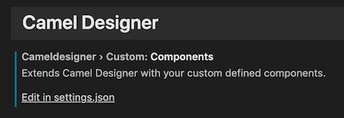

# How to...

This section describes how to perform some of the most common user actions with *Camel Designer*:

 - [Getting Started](#getting-started)
 - [Define REST definitions](#define-rest-definitions)
 - [Navigate the code](#navigate-the-code)
 - [Organise activities](#organise-activities)
 - [Work with Groups](#work-with-groups)
 - [Work with Try-Catch blocks](#work-with-try-catch-blocks)
 - [Work with the AtlasMap activity](#work-with-the-atlasmap-activity)
 - [Trace Camel Exchanges](#trace-camel-exchanges)
 - [Extend menu options](#extend-menu-options)

<br>

## Getting Started

When starting from scratch and to start defining Camel routes, follow the steps below:

1. In VS Code, create a new workspace.
2. From the menu, select **File > New File**
3. To activate the designer view button, change the file language to XML, by either:
    - clicking on the language in the status bar (bottom right corner)
    - pressing the keys (Mac) <kbd>⌘</kbd>+<kbd>K</kbd> then <kbd>M</kbd>, (Windows) <kbd>Ctrl</kbd>+<kbd>K</kbd> then <kbd>M</kbd>
4. The preview button will appear (top right), click on it as shown in the animation below.
5. The Designer view will load, you can now model you Camel definitions.


<br>

## Define REST definitions

The visual editor includes a REST designer where you can define groups of REST methods. As you create new REST elements, the tool translates them into Camel REST DSL in the text editor.

It's important to know that REST definitions represent HTTP entry points to Camel. You can define REST methods such as GET/POST/PUT.
For each entry point defined (REST operation), Camel Designer links the REST method to a Camel Route that will process the request. REST Camel routes require to have a `'direct'` starting activity.

You can start defining your REST operations and later define your Camel routes. You can also start defining your Camel routes first and then your REST operations. Just make sure your REST operations are correctly linked to your Camel routes.

On the example below, we assume a Camel Route `route1` already exists, and we'd like to define a GET operation that triggers the Camel route. To include a new REST definition to the *Camel* project, follow the steps below:

1. In the visual editor, click on the <kbd>REST</kbd> button. This action activates the REST viewer.
2. From the <kbd>rest..</kbd> menu, select the option: <kbd>new group...</kbd>. This action will create a new REST group
3. From the <kbd>rest..</kbd> menu, select the option: <kbd>GET</kbd>. This action will define a GET operation with a `direct` call activity.
4. Click on the `direct` activity and select on the configuration pane `route1`
5. If `route1` exists, you can double click on the direct activity to jump to the Camel Route definition

<br>

The animation below illustrates how to interact with the REST editor:


<br>

## Navigate the code

Moving around with ease to inspect different Camel routes and activities is important.

There are two ways for users to move around the code.

1. Interact with the Visual Editor:
    - when you click on activities the camera will move and focus on the selected activity. The configuration pane will display related information and available options.
    - to step back, or gain freedom of movement, use the arrow keys to move around the scene. Automatic camera control will reactivate when you click on an activity.

2. Interact with the Text editor
    - clicks on the text editor will reposition the text cursor. *Camel Designer* will react and move the camera setting focus on the corresponding activity.
    - if the cursor is replaced in a different route, *Camel Designer* will switch and show the selected *Camel* route.

<br>

The animation below illustrates how to navigate the code by interacting with the XML source code:

  

<br>

## Organise activities

One of the main motivation to use Visual Editors is to gain the ability to intuitively understand processing flows.

While working with process definitions, you might want to:
  - move activities around for better readability.
  - change order of activities

There are two ways for users to organise the code.

1. Interact with the Visual Editor:
    - use 'Drag & Drop' to move activities around. Click on an activity and drag it where needed.
    - use 'Detach/Attach' on detachable activities to change executional order of activities. To discover 'detachable' activities press <kbd>SHIFT</kbd> , they will be highlighted in yellow. While <kbd>SHIFT</kbd> is pressed you can click on the activity, and then drag it to a new position.

2. Interact with the Text editor
    - As an alternative, you can close the Visual Editor, then cut/paste portions of Camel XML code to reorganise to your needs. Then open the Visual Editor which will show the new activities layout.

    > **Attention**: \
    Ensure the newly organised code is valid, Camel Designer does not currently implement a code validation process. If the code is not valid it will result in unexpected behaviour.

<br>

The animation below illustrates how to detach/attach activities:

  

<br>

## Work with Groups

Certain EIP patterns may contain activities inside a *Group*, for example the *Split* pattern. Visually, these groups are represented in *Camel Designer* as boxes containing activities.

You can interact with *Groups* in a number of ways to organise activities. In summary, these are possible user actions at your disposal:
 - Add new activities within a group
 - Move the entire group of activities with a drag'n'drop action.
 - Attach/detach activities in and out of the group
 - Drag'n'drop activities within a group. The group box will automatically re-adjust
 - Delete group activities
 - Manually extend/retract the group's width by dragging the end edge activity. 

<br>

The animation below illustrates how to interact with a group of activities:

  

<br>

## Work with Try-Catch blocks

Camel Designer includes *Try-Catch* definitions (mapping to Camel's DSL *Try-Catch-Finally* blocks). They are visually represented as a collection of *Groups* (see section: [Working with Groups](#working-with-groups)), one for *Try* activities, a second one for *Catch* activities, and a final one for *Finally* activities.

To prevent a visual overload, by default *Camel Designer* hides the *Catch* and *Finally* groups. The user can hide/reveal these groups by clicking the deploy/undeploy buttons.

You can interact with *Try-Catch* blocks as you would with generic groups, for example by adding/deleting/moving activities.

To define the exceptions to catch, click on the *Catch* activity (*Catch* group), and configure it by adding/deleting the relevant Java exceptions.

The animation below illustrates how to interact with a *Try-Catch* blocks:

  

<br>


## Work with the AtlasMap activity

[AtlasMap](https://www.atlasmap.io/) is a visual data mapping editor to define Java, XML, CSV and JSON transformations interchangeably. Camel Designer integrates with AtlasMap's VSCode extension to create and edit mapping definitions.

In Camel Designer, to add an AtlasMap activity, select the ```transform > AtlasMap``` option from the menu bar. This action will append a new AtlasMap activity after the currently selected activity (highlighted by a yellow ring). The configuration panel shows a default ```demo.adm``` selection. The dropdown list contains a list of available ADM (AtlasMap Data Mapping) files in your workspace.

 - ### Edit an existing ADM file
   From Camel Designer, edit (or open) an ADM in your workspace by selecting the ADM file from the dropdown list, and clicking ```edit```. This action will launch the AtlasMap viewer in a new tab and load the selected ADM definition.

 - ### Create a new ADM file
   From Camel Designer, create a new ADM file by clicking the button ```new```. This action will launch the AtlasMap extension, it will prompt you to select a workspace and the name of your ADM file, and finally will open the viewer with an empty mapping definition.

     

<br>

> **Note:** \
The ```delete``` button in the configuration panel deletes the activity only, it does **NOT** delete the ADM file in your workspace.

<br>

## Trace Camel Exchanges

As part of the development process, it's important to validate the code executes as expected. Tracing allows you to have a magnifying glass to inspect each activity's data input/output, and to have an overall view of the execution path the process follows.

The current tracing functionality in *Camel Designer* allows you to connect to a running Camel instance and obtain live tracing information. The user can interact with the interface to pick executed jobs and inspect them.

These are the requirements to enable tracing:

1. A Java process with a Camel Context needs to be up and running
2. The above Camel instance needs to be Jolokia enabled (HTTPS is currently not supported)
3. The Camel XML code running in the Java process needs to match the code displayed in *Camel Designer*

If the above conditions are met, tracing can be enabled. Tracing options and switches are located in the upper right corner of the screen.


Follow the steps below to visualise traces:

1. Click on the <kbd>C</kbd> button (for configuration) and ensure the URL to your remote Camel/Jolokia instance is correct.
2. Click <kbd>ok</kbd> to accept and close the tracing configuration panel.
3. Click on the switch to turn ON tracing (grey is OFF, blue is ON). If the connection to Jolokia is unsuccessful, an alert message will show and tracing will stay disabled.
4. When tracing has been enabled enabled, trigger a job to be executed in Camel (via HTTP or other means).
5. Camel Designer has a timer and will repeatedly poll the Java process for new traces.
6. When a new Trace is collected, the Camel Exchange ID will pop up on screen. If more traces are collected, then multiple Exchange IDs will be listed.
7. Click on the Exchange ID you'd like to inspect. This action will highlight in yellow the path execution in the process definition.
8. To inspect headers and body data, hover your mouse over the highlighted links.
9. The tracing configuration panel allows you to select the data to be displayed (headers/body).
10. You can discard a trace by clicking the cross button in the Exchange ID.
11. When you're done, you can disable tracing by clicking in the ON/OFF switch.

<br>

The animation below illustrates how tracing is operated:

  

<br>

### How to enable Jolokia

Java processes running Camel do not include Jolokia by default. You will need to manually add Jolokia and configure your instance to allow connections from tracing clients.

The example below illustrates how to do so, based on a Fuse Spring Boot (v1) instance.

1. Include the following dependency in your POM file:

    ```xml
    <dependency>
        <groupId>io.hawt</groupId>
        <artifactId>hawtio-springboot-1</artifactId>
    </dependency>
    ```

2. Include the following parameters in the `application.properties` file:

    ```properties
    management.port=10001

    # enable management endpoints for healthchecks and hawtio
    endpoints.enabled = false
    endpoints.hawtio.enabled = true
    endpoints.jolokia.enabled = true
    endpoints.health.enabled = true
    management.health.defaults.enabled=false
    camel.health.enabled=false
    camel.health.indicator.enabled=true
    endpoints.jolokia.sensitive=false
    endpoints.hawtio.sensitive=false
    hawtio.authenticationEnabled=false
    ```
3. Restart the Java process.

    If the Java process is configured as above and running locally where VSCode is running, then the default URL would be valid:

       http://localhost:10001/hawtio/jolokia

<br>

## Extend menu options

Camel Designer comes with a predefined set of menu actions the user can choose from. You start defining Camel routes by selecting a consumer component, for example a *Timer* component, and then you use other menu drop down lists to select EIP patterns or producer components.

> *Note*: \
**Consumer** components in *Camel* are starting activities, they 'consume' incoming events traversing the entire *Camel* route. \
**Producer** components in *Camel* are mid-flow activities, they typically 'produce' outgoing events, like HTTP requests to external endpoints.

At the moment Camel Designer is very limited in palette options while in 'prototype' version. You can however extend Camel Designer with custom configurations to create your own consumers and producers, and have them available in the menus.

You edit Camel Designer's configuration from VSCode's settings. To open your user and workspace settings, use the following VS Code menu command:

 - On Windows/Linux - File > Preferences > Settings
 
    You can also open the Settings editor from the Command Palette (<kbd>Shift</kbd>+<kbd>Ctrl</kbd>+<kbd>P</kbd>) with Preferences: Open Settings or use the keyboard shortcut (<kbd>Ctrl</kbd>+<kbd>,</kbd>).
 
 - On macOS - Code > Preferences > Settings
 
    You can also open the Settings editor from the Command Palette (<kbd>Shift</kbd>+<kbd>⌘</kbd>+<kbd>P</kbd>) with Preferences: Open Settings or use the keyboard shortcut (<kbd>⌘</kbd>+<kbd>,</kbd>).

The action above opens the UI settings in VSCode. Find the configuration section for *Camel Designer* under:

 - Extensions > Camel Designer

You should find the following configuration block:

     

Click the link: <u>`Edit in settings.json`</u> \
You should find the following property with default configuration (empty producers/consumers):

```json
"cameldesigner.custom.components": {

    "consumers": [],
    "producers": []
},
```

As an example on how to extend the menu with a new component, let's add the following configuration entities:

```json
{
    "consumers": [
        {
            "label":    "demo http",
            "function": "createCustomEndpointFrom",
            "arguments": ["demo-http:localhost:8080/demo/service?matchOnUriPrefix=true"]
        }        
    ],
    "producers": [
        {
            "label":    "demo http",
            "function": "createCustomEndpointTo",
            "arguments": ["demo-http:somehost:8000/somepath?someOption=someValue"]
        }
    ]
}
```
> **Attention:** \
Ensure that consumers (`from...`) are configured with the function `createCustomEndpointFrom`. Doing otherwise will lead to buggy behaviour in Camel Designer   

> **Attention:** \
Ensure that producers (`to...`) are configured with the function `createCustomEndpointTo`. Doing otherwise will lead to buggy behaviour in Camel Designer

<br>

> **Note:** \
For changes to activate, save the configuration changes, and then close and reopen *Camel Designer*.

The above configuration will add a new consumer in the `from...` drop down menu and a new producer in the `to...` drop down menu
as shown below:

      


If we create a route using the newly created components Camel Designer should render the following flow:

     

<br>

---

